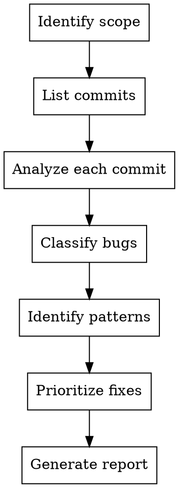

# Bug Tracker - Exploratory Bug Analysis from Git History

## Overview

Systematic methodology for finding bugs in recent commits by analyzing code changes commit-by-commit, classifying severity, identifying developer-specific patterns, and producing a prioritized remediation plan.

## When to Use

- User asks to review recent commits for bugs or code quality issues
- User wants an audit of a specific developer's recent work
- User asks "what bugs were introduced recently?"
- Post-sprint quality review
- Pre-release code audit

## Workflow



### Step 1: Identify Scope

Ask the user (or infer from context):
- **Branch**: Which branch to analyze (usually `develop` or feature branches)
- **Developers**: Specific developers or all recent contributors
- **Time range**: Last N commits or date range
- **Focus areas**: Specific modules/features or entire codebase

```bash
# List recent contributors
git log --format='%aN' --since='2 weeks ago' | sort -u

# List commits by developer
git log --author="Developer Name" --oneline --since='2 weeks ago'
```

### Step 2: Analyze Each Commit

For **each commit**, read the full diff and the affected files:

```bash
# View commit diff
git show <commit-hash> --stat
git show <commit-hash>

# Read full file for context (not just the diff)
# Use Read tool on each affected file
```

**What to look for in each commit:**
- Null/undefined access without guards
- Async operations without `await` (fire-and-forget)
- Hardcoded values that should be configurable
- Security issues (exposed keys, missing validation)
- Missing error handling
- Hardcoded user-facing strings that should be localized/configurable
- CSS without responsive breakpoints
- Violated project rules (check CLAUDE.md)
- Race conditions
- Type coercions (`as unknown as X`)
- Cache/state that leaks between contexts

### Step 3: Classify Each Bug

Use four severity levels:

| Severity | Criteria | Examples |
|----------|----------|---------|
| **CRITICAL** | Security risk, data loss, system crash, legal/compliance | API keys exposed, destructuring null crashes app, privacy regression |
| **HIGH** | Silent data corruption, race conditions, affects many users | Missing `await`, domain truncation, broken filters |
| **MEDIUM** | Feature broken in specific scenarios, UX degraded | Cache leaks, no mobile responsive, type coercions |
| **LOW** | Polish issues, future risk, minor inconsistencies | hardcoded strings, permanent redirects, missing validation |

### Step 4: Document Each Bug

For each bug, record:

```markdown
#### Bug #N - [Short descriptive title]

- **Commit**: `<hash>` - "<commit message>"
- **File**: `<path>`, line(s) N
- **Problematic code**:
  ```language
  // The exact code with the issue
  ```
- **Problem**: [What's wrong and WHY it's wrong]
- **Impact**: [What happens in production — be specific about affected users/flows]
- **Suggested fix**:
  ```language
  // Corrected code
  ```
```

### Step 5: Identify Patterns Per Developer

After documenting all bugs, group by developer and look for recurring patterns:

```markdown
| Pattern | Related Bugs | Observation |
|---------|-------------|------------|
| Missing null guards | #1, #4 | Destructuring and method calls without checks |
| Async without await | #2 | Fire-and-forget on DB operations |
```

This is NOT for blame — it's for targeted mentoring and code review checklists.

### Step 6: Prioritize Fixes

Group bugs into 4 priority tiers based on: production impact, security risk, number of affected users, and fix complexity.

| Priority | Timeline | Criteria |
|----------|----------|----------|
| **P1** | Same day | Security, crashes, compliance |
| **P2** | This week | Silent corruption, race conditions |
| **P3** | 2 weeks | Feature bugs, UX issues |
| **P4** | Backlog | Polish, future risk |

Include effort estimates per bug and total per priority tier.

### Step 7: Generate Report

Save the report as `docs/bug-report-YYYY-MM-DD.md` with this structure:

1. **Header**: Date, requester, analyzer, branch, developers analyzed, total bugs
2. **Executive summary**: 2-3 sentences with key findings
3. **Consolidated table**: All bugs with severity, developer, description, file, commit
4. **Severity distribution table**: Counts by severity per developer
5. **Detailed bugs per developer**: Full documentation (Step 4 format)
6. **Pattern analysis**: Recurring issues per developer (Step 5)
7. **Prioritized fix plan**: 4 tiers with effort estimates (Step 6)
8. **Recommendations**: Linting rules, code review improvements, test suggestions

## Common Mistakes

| Mistake | Better Approach |
|---------|----------------|
| Only reading the diff, not the full file | Always `Read` the complete file for context — bugs often depend on surrounding code |
| Flagging style issues as bugs | Focus on behavioral bugs, not formatting preferences |
| Vague impact descriptions | Be specific: "affects a specific customer segment" not "may cause issues" |
| Suggesting fix without understanding architecture | Read CLAUDE.md and project patterns before suggesting fixes |
| Missing project-specific rules | Always check CLAUDE.md for project conventions (localization, tenant/scope isolation, etc.) |
| Analyzing too many commits at once | Use subagents for parallel commit analysis when scope > 10 commits |

## Parallel Analysis with Subagents

For large scopes (many developers or commits), dispatch subagents:

```
Agent: "Analyze commits by [Developer Name] on branch develop since [date].
For each commit, read the full diff and affected files.
Document any bugs found using this format: [include Step 4 format].
Return the list of bugs found."
```

Then consolidate results in the main conversation for pattern analysis and prioritization.
