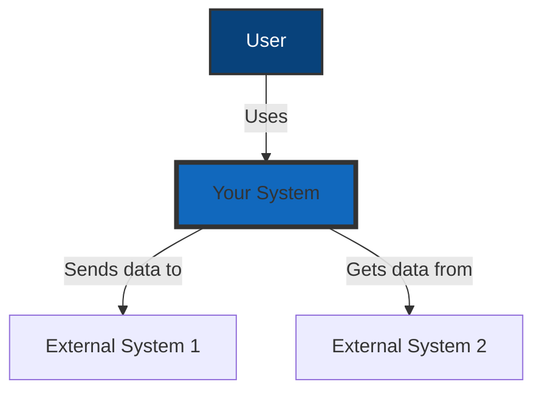
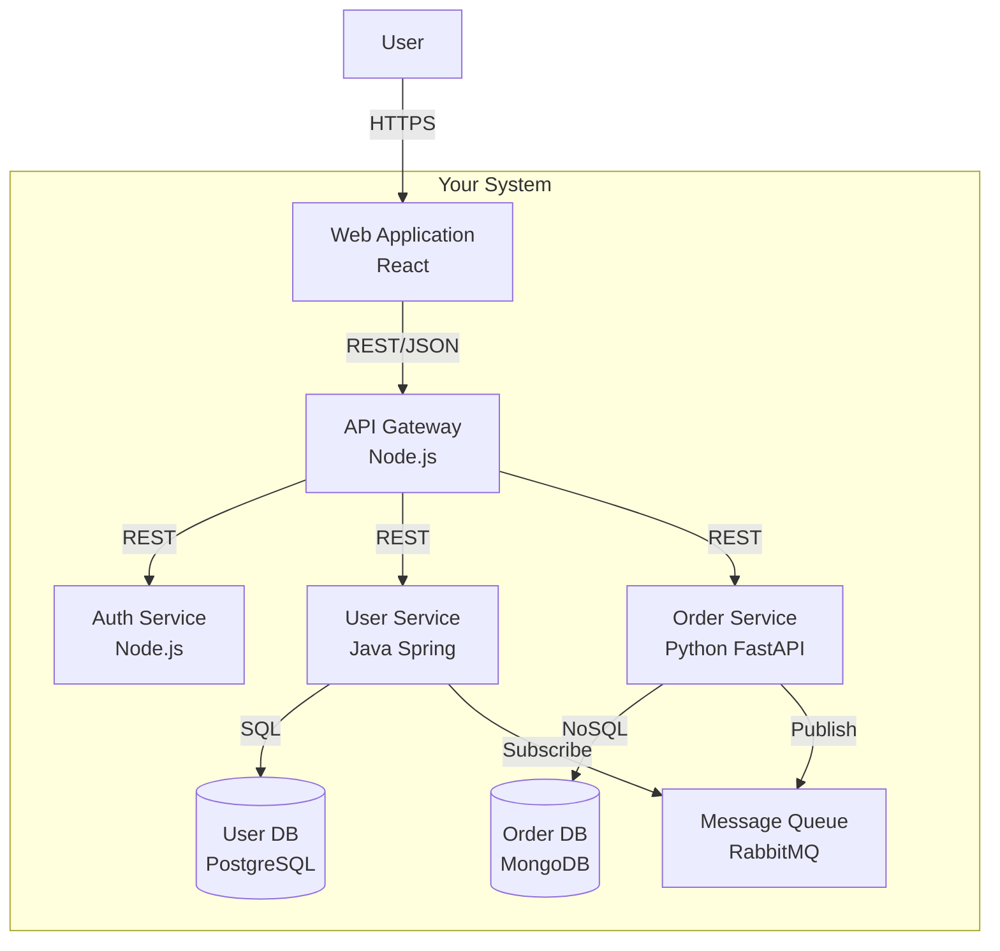
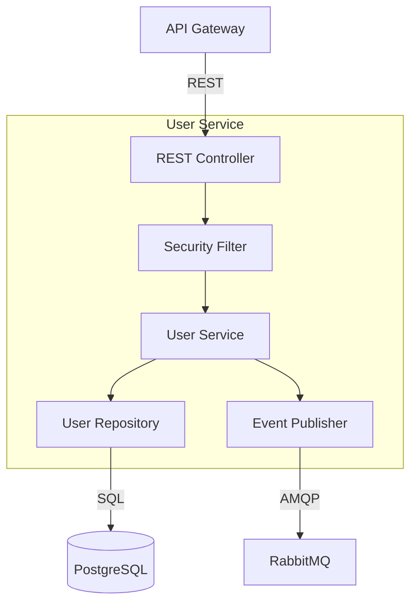
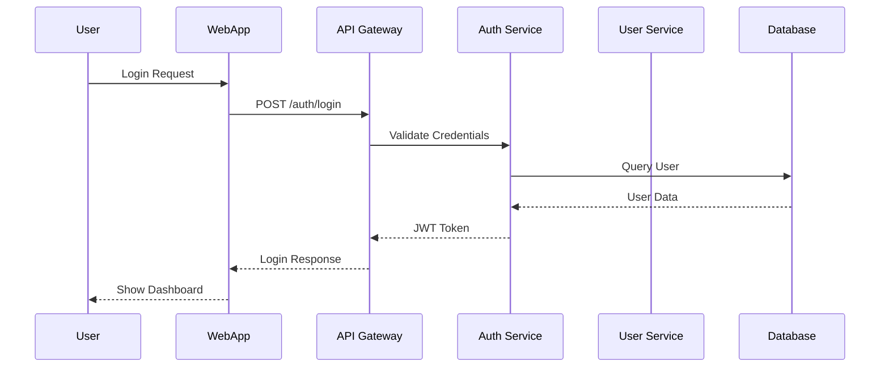
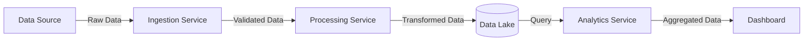
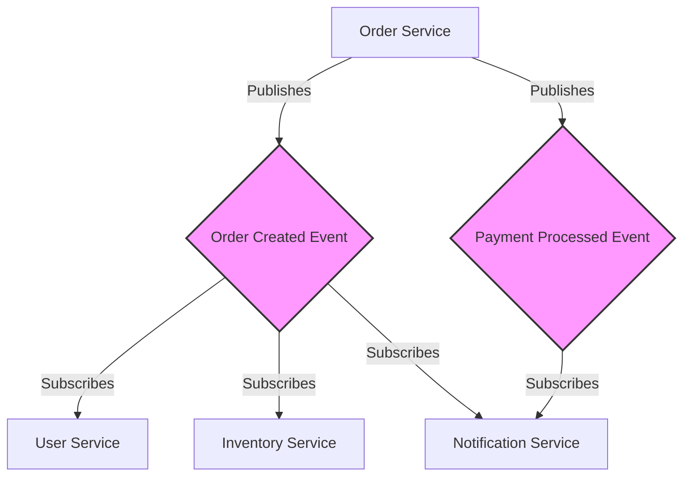
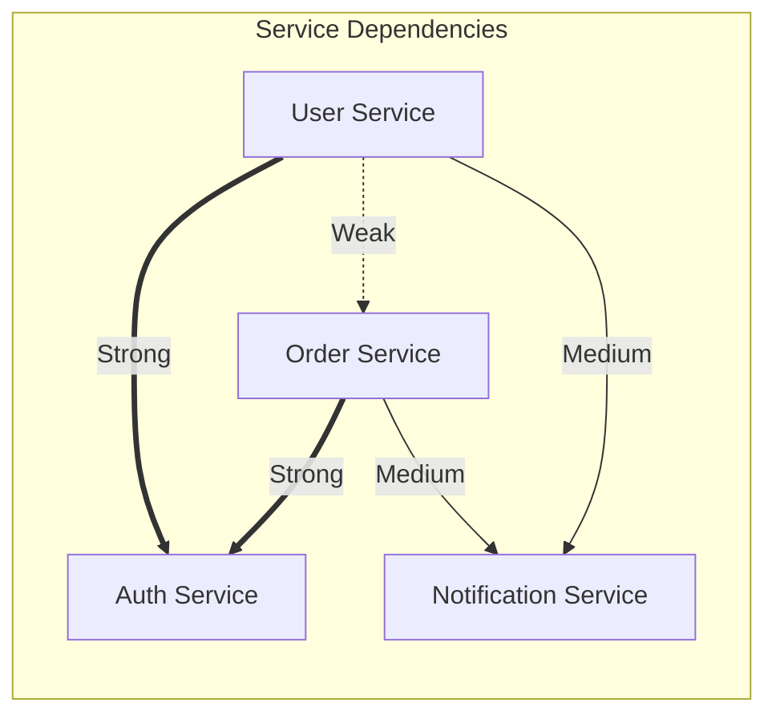

# C4 Model Templates

## Overview
The C4 model provides a hierarchical way to describe software architecture using Context, Container, Component, and Code diagrams.

## System Context Diagram (Level 1)

### Mermaid Template


### PlantUML Template
```plantuml
@startuml
!include https://raw.githubusercontent.com/plantuml-stdlib/C4-PlantUML/master/C4_Context.puml

Person(user, "User", "A user of the system")
System(system, "Your System", "Description of your system")
System_Ext(ext1, "External System 1", "Description")
System_Ext(ext2, "External System 2", "Description")

Rel(user, system, "Uses")
Rel(system, ext1, "Sends data to")
Rel(system, ext2, "Gets data from")
@enduml
```

## Container Diagram (Level 2)

### Mermaid Template


### PlantUML Template
```plantuml
@startuml
!include https://raw.githubusercontent.com/plantuml-stdlib/C4-PlantUML/master/C4_Container.puml

Person(user, "User")
System_Boundary(system, "Your System") {
    Container(webapp, "Web Application", "React", "Provides UI")
    Container(api, "API Gateway", "Node.js", "Routes requests")
    Container(auth, "Auth Service", "Node.js", "Authentication")
    Container(userservice, "User Service", "Java Spring", "User management")
    Container(orderservice, "Order Service", "Python", "Order processing")
    ContainerDb(userdb, "User Database", "PostgreSQL", "User data")
    ContainerDb(orderdb, "Order Database", "MongoDB", "Order data")
    ContainerQueue(queue, "Message Queue", "RabbitMQ", "Async messaging")
}

Rel(user, webapp, "Uses", "HTTPS")
Rel(webapp, api, "Makes API calls", "REST/JSON")
Rel(api, auth, "Authenticates", "REST")
Rel(api, userservice, "User operations", "REST")
Rel(api, orderservice, "Order operations", "REST")
Rel(userservice, userdb, "Reads/Writes", "SQL")
Rel(orderservice, orderdb, "Reads/Writes", "NoSQL")
Rel(orderservice, queue, "Publishes events")
Rel(userservice, queue, "Subscribes to events")
@enduml
```

## Component Diagram (Level 3)

### Mermaid Template


## Sequence Diagram Template

### Mermaid Template


## Data Flow Diagram Template

### Mermaid Template


## Event Flow Diagram Template

### Mermaid Template


## Dependency Matrix Template

### Markdown Table
```markdown
| Service | User Service | Order Service | Auth Service | Notification | Database |
|---------|-------------|---------------|--------------|--------------|----------|
| **User Service** | - | HTTP | HTTP | Event | PostgreSQL |
| **Order Service** | HTTP | - | HTTP | Event | MongoDB |
| **Auth Service** | - | - | - | - | PostgreSQL |
| **Notification** | Event | Event | - | - | - |
```

### Mermaid Heatmap Style


## Best Practices

1. **Consistency**: Use the same notation and style across all diagrams
2. **Clarity**: Label all connections with protocols/formats
3. **Confidence**: Mark uncertain connections with dashed lines
4. **Versioning**: Include API versions where relevant
5. **Legend**: Add a legend for symbols and confidence levels

## Confidence Notation

- **Solid lines**: HIGH confidence (verified in code)
- **Dashed lines**: MEDIUM confidence (inferred)
- **Dotted lines**: LOW confidence (assumed)
- **Red elements**: Critical/High priority
- **Yellow elements**: Warning/Medium priority
- **Green elements**: Healthy/Low priority
